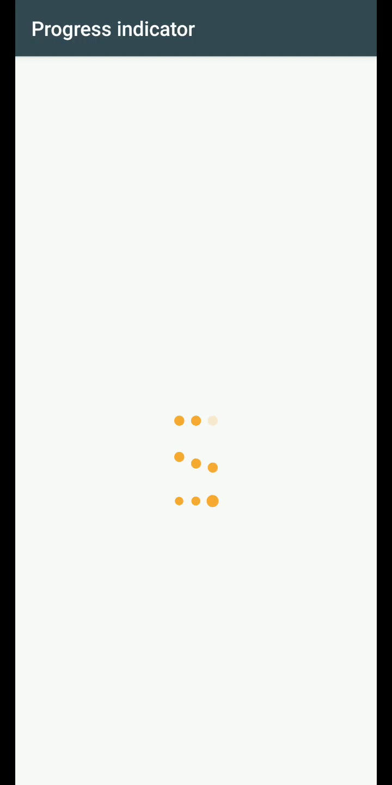

# progress-bar
Step 1. Add the JitPack repository to your build file
=====================================================
Add it in your root build.gradle at the end of repositories:

	allprojects {
		repositories {
			...
			maven { url 'https://jitpack.io' }
		}
	}
Step 2. Add the dependency
======================================================
	dependencies {
	        implementation 'com.github.JB-Dev:progress-bar:1.0'
	}
Step 3. Add XML code
======================================================
    <com.jb.dev.progress_indicator.fadeProgressBar
        android:id="@+id/p1"
        android:layout_width="50dp"
        android:layout_height="40dp"
        android:layout_centerInParent="true" />

    <com.jb.dev.progress_indicator.dotBounceProgressBar
        android:id="@+id/p2"
        android:layout_width="50dp"
        android:layout_height="40dp"
        android:layout_below="@+id/p1"
        android:layout_centerInParent="true"
        android:background="@color/colorAccent" />

    <com.jb.dev.progress_indicator.dotGrowProgressBar
        android:layout_width="50dp"
        android:layout_height="40dp"
        android:layout_below="@id/p2"
        android:layout_centerInParent="true" />
Output
=======================================================

